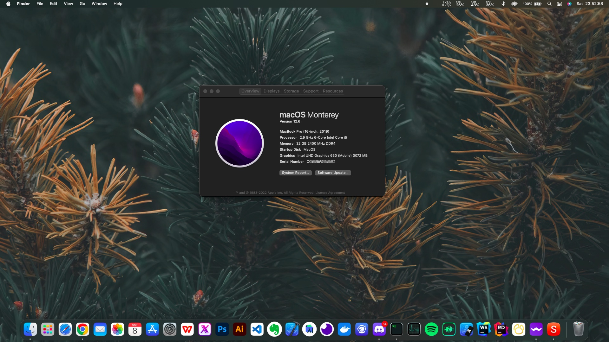

#  2AM E550 - Monterey/Ventura

####  Screenshot

## Meu Sistema
- Processador: Intel® Core ™ i5 9400 Coffee Lake
- Ram: 32GB DDR4
- Chipset: H370
- Gráfico: Intel® UHD Graphics 630 e Nvidia GeForce® GTX 1050 3GB
- Armazenamento: 1TB M.2 Nvme (Windows/MacOS) / 1TB SSD Sata (Games) / 1TB Nvme SATA (Arquivos)
- Rede e Bluetooth: Intel(R) Wireless-AC 9462
- Áudio: Realtek ALC269
- Touchpad: Synaptics SMBus TouchPad
- BIOS: American Megatrends Inc 1.07.08X (16/08/2019)

## Informações Importantes
- Open Core na versão 0.8.5
- Essa EFI funciona nas versões do MacOS Monterey 12.3.1 à 12.6
- No Ventura foi instalado a versão Beta 9, e nada foi instalado nem atualizado ou seja, é funcional para instalação, porém não asseguro que esteja 100% funcional, ou seja, pode ser necessário modificações.
 - Tem adicionado porém desabilitado a kext de Wi-fi genérico, caso a Kext atual não funcione com o MacOS Ventura.
 - Junto com a Kext genérica, também envio o Heliport para conseguir usar o Wi-fi (no MacOS Ventura, caso a Kext atual não funcione).
##  BIOS

- Desabilite o Boot via Rede.
- Habilite VT-X
- Defina o modo SATA para AHCI.
- Desativar inicialização segura
- Gerar novo SMBIOS [GenSMBIOS](https://github.com/corpnewt/GenSMBIOS)
- Corrija o CFG-Lock para um melhor gerenciamento de energia [Dortania](https://dortania.github.io/OpenCore-Desktop-Guide//extras/msr-lock)

## DICAS
- Eu não sou um profissional da parte de Hackintosh, então essas UEFIs são o resultado de muita pesquisa e umas modificações leves.
- A EFI serve tanto para instalação quando para o boot no HD que já tem as Kexts corretas para o funcionamento de tudo o que está descrito abaixo.
- Se você conheçe mais desse universo e conseguir melhorias faça a solicitação de Pull Request, será um prazer testar e adicionar melhorias.

##  O que está funcionando:
- [x] Áudio, entrada / microfone, saída e [ComboJack](https://github.com/hackintosh-stuff/ComboJack)
- [x] HDMI (Essa é ligada ao chipset e não a GTX)
- [x] Gerenciamento de bateria
- [x] Leitor de Cartão
- [x] Wi-fi e Bluetooth
- [x] Ethernet
- [x] Sleep & Wake
- [x] WebCam
- [x] Usb 3.1 e Tipo C
- [x] Suporte a tecla de atalho com teclas Fn (exceto brilho)
- [x] Trackpad com Gestos
##  Não funciona:
- Mini Display Port devido a ligação com a GTX 1050
- Nvidia GeForce® GTX 1050
- Alteração das Luzes do teclado.
- Airdrop

##  Créditos
-  ** Agradecimentos especiais ** a [dortania](https://dortania.github.io/vanilla-laptop-guide) pelo guia do laptop vanilla.
-  ** Agradecimentos especiais ** a [Acidanthera](https://github.com/acidanthera) pela maioria dos Kexts.
- Graças a [OpenCore Bootloader](https://github.com/acidanthera/OpenCorePkg).
- Agradecimentos a [daliansky](https://github.com/daliansky) por [ACPI Hotpatch Samples for the OpenCore Bootloader](https://github.com/daliansky/OC-little).
- Agradecimentos a [alexandred](https://github.com/alexandred) por [VoodooI2C](https://github.com/alexandred/VoodooI2C).
- Agradecimentos a [hackintosh-stuff](https://github.com/hackintosh-stuff) para [ComboJack support for ALC255](https://github.com/hackintosh-stuff/ComboJack).
- Agradecimentos a [corpnewt](https://github.com/corpnewt) para [GenSMBIOS](https://github.com/corpnewt/GenSMBIOS).
- Agradecimentos a [OpenIntelWireless](https://github.com/OpenIntelWireless) para [HeliPort](https://github.com/OpenIntelWireless/HeliPort/releases).
- Para suporte da comunidade, acesse o discord [Universo Hackintosh](https://discord.gg/yqPq3Rvw)
- Agradecimentos a [Gabriel Luchina](https://github.com/luchina-gabriel) pelos repositórios de EFIs Base.